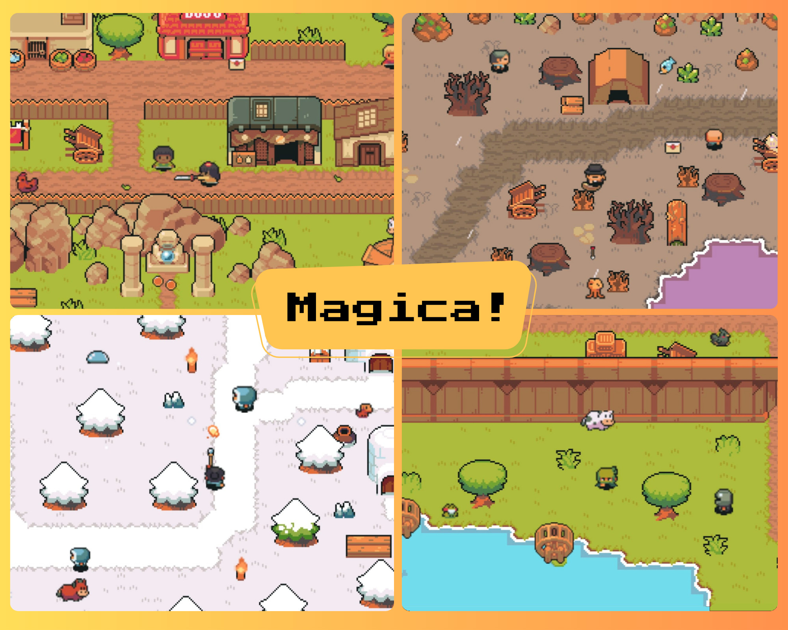

# Magica - A 2D RPG Adventure Game



**Magica** is a 2D RPG adventure game built from scratch using vanilla JavaScript, HTML5 Canvas, and CSS. Explore a vast world, battle enemies, and uncover the secrets hidden within the realm of Magica!

## ✨ Features

- **Dynamic Gameplay:** Experience a classic 2D RPG with a top-down perspective, featuring a rich and interactive world.
- **Responsive Design:** Play on any screen size, from desktops to mobile devices.
- **Pub/Sub Architecture:** A robust event-driven system manages game logic, ensuring a modular and scalable codebase.
- **Expansive World:** Explore over 20+ unique in-game locations, each with its own set of design and challenges.
- **Engaging Story:** Immerse yourself in a captivating narrative with the quest.
- **Multiple Weapons:** Choose from a variety of weapons to suit your playstyle (only one melee and range at a time).
- **Challenging Enemies:** Face a diverse range of enemies, each with varing hitpoints and range.

## 🎮 Gameplay

- **Movement:** Control the player using the WASD or arrow keys.
- **Combat:** Attack enemies with your equipped weapon using the spacebar.
- **Heal:** Heal characters hitpoints by pressing the "Z" key.
- **Swap Weapons:** Use Shift to swap weapons form range to melee or vice-versa.

## 🛠️ Tech Stack

- **JavaScript (ES6+):** The core game logic is written in modern JavaScript.
- **HTML5 Canvas:** Renders all graphics and animations.
- **CSS3:** Styles the UI and game elements.
- **Vite:** A fast and lightweight development server and build tool.
- **Bun:** A modern JavaScript runtime and package manager.

## 📂 Project Structure

```
/
├── public/ # Static assets (images, sounds, etc.)
├── src/ # Source code
│   │
│   ├── abjecentLists/ # contains map specific data 
│   ├── classes/ # Game object classes
│   ├── constants/ # Game constants (directions, health, etc.)
│   ├── meta/ # Infomation about game objects
│   ├── store/ # States
│   ├── ui/ # UI components
│   ├── util/ # Utility functions
│   │
│   ├── main.js # Entry point
│   ├── eventListenera.js # All the pub/sub logic
│   ├── updateLoop.js # Game eventloop
│   ├── menu.js # Ui elements logic
│   └── declare.js # init objects
│
├── index.html # Main HTML file
└── package.json # Project dependencies
```

## 🚀 Getting Started

### Prerequisites

- [Node.js](https://nodejs.org/en/) (v14 or higher)
- [Bun](https://bun.sh/) (optional)

### Installation

1. **Clone the repository:**

   ```sh
   git clone https://github.com/SamTheTechi/magica.git
   cd magica
   ```

2. **Install dependencies:**

   ```sh
   bun install # or npm install
   ```

3. **Start the Development Server:**

   ```sh
   bun run dev # or bun run dev
   ```

Then open [http://localhost:5173](README.md) in your browser.

## License

This project is licensed under the **MIT License**. See the [LICENSE](LICENSE) file for details.

## Acknowledgements

- All assets used in this project are from [itch.io](https://itch.io/).
- The game is inspired by the classic "The Legend of Zelda" series.

---

Made with ❤️ by [Sameer Gupta](https://github.com/SamTheTechi)
